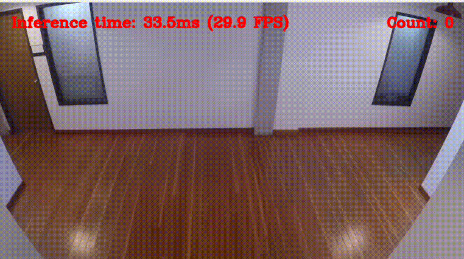

# Crowd Detection을 이용한 혼잡도 파악 후 안전사고 방지 프로그램


# Person Counting Project

[]()
[]()
[]()
[]()
[]()
[]()


## 🍚개요

해당 프로젝트는 이태원 참사, 공연장 압사 사고등 단 시간에 많은 사람들이 몰려 인파를 제때 통제하지 못해 발생하는 사건사고들을 사전에 방지하기위한 프로젝트이다. 이를 구현하기위해 OpenVINO를 통한 객체인식을 활용하여 공간에 사람이
얼마나 몰려있는지를 공간 혼잡도를 시각적으로 파악한다. 결과적으로 임계값을 넘는 수준의 혼잡도가 발생하면 경고를 하거나 인파를 통제함으로써 발생할 수 있는 사고를 미연에 방지하는 기능을 제공한다.


## 🛼프로젝트의 구성


기본적으로 프로젝트는 OpenVINO 샘플들 중 [person-counting-webcam](https://github.com/openvinotoolkit/openvino_notebooks/tree/latest/notebooks/person-counting-webcam)을 참고한다.
예제는 화면에서 사람객체의 위치를 파악하고 특정 선을 넘어가는 사람의 수를 체크하고 이를 윈도우를 통해 보여주는 기능을 제공한다.


프로젝트에서 기본적으로 제공하는 기능을 삭제하고 프레임에 나타난 사람객체를 파악하고 객체의 수를 출력하는 기능으로 교체했다.



최종적으로 프레임에 얼마나 많은 사람이 있는지를 바운딩박스의 영역을 계산하여 혼잡도를 계산했다.


### 🚟최종 제공 기능


영상에서 보듯이 프레임에서의 인파를 파악하고 몰려있는 인파의 바운딩 박스를 통해 공간의 혼잡도를 파악하여 자동으로 인파를 통제하는 하드웨어를 추가하거나 관리자에게 알림을 하는 방식으로 인파가 몰려 발생할 수 있는 사고를 미연에 방지하는 기능에 활용가능하다.


## 🗂 프로젝트 구조

project/\
├── PersonCounter/ # 메인 모듈\
│ └── PersonCounter.py/ # 카운팅 로직 클래스\
├── models/ # OpenVINO 변환된 모델 파일\
├── download.py # 모델 다운로드 도우미\
├── main.py # 실행 스크립트\
├── requirements.txt # Python 의존성\
└── README.md # 설명서\

## ⚙️ 설치 및 실행

### 1. 의존성 설치

```bash
python -m venv .minivenv
source .minivenv/bin/activate
pip install -r requirements.txt
```

### 2. 실행
```bash
python download.py #YOLO모델 및 샘플영상자료 다운로드
python main.py #참조할 영상은 main.py의 VIDEO_SOURCE의 경로를 수정하세요.
```

## 💻 테스트 환경

- Ubuntu 22.04
- Python 3.10
- OpenVINO 2023.3
- Ultralytics YOLOv8
- OpenCV 4.8

